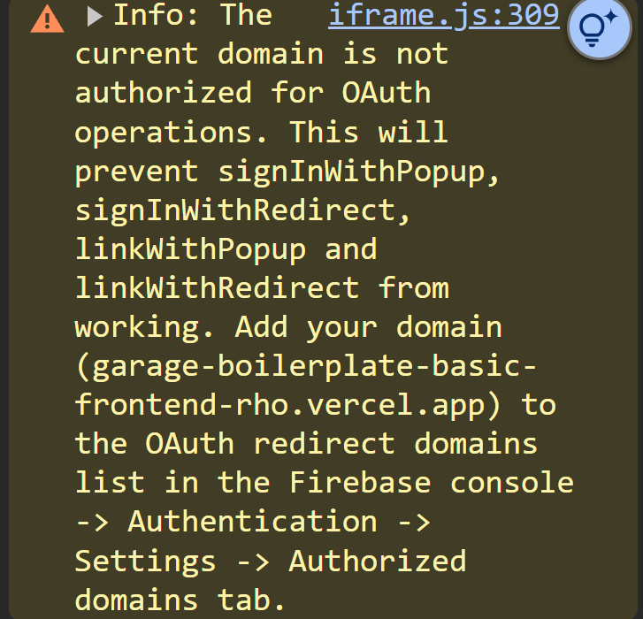
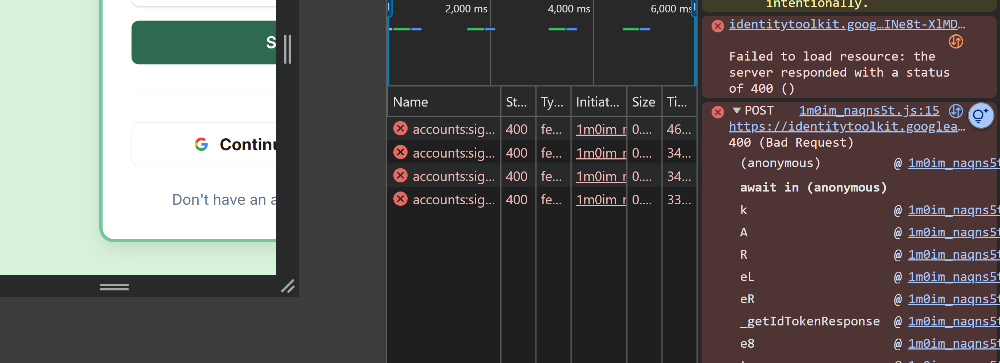
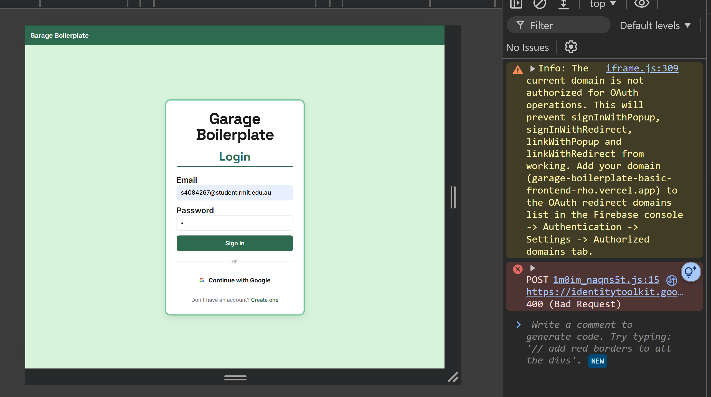

# Login Page — Edge Case Testing

**Tester:** Sajad Ali Akbari
**Date:** 14/08/2026
**Build tested:** commit bed5cc3f837053e342bfd8975164fa6c5fcca9ea
**Browser / version:** Chrome 151.0.7922.138
**Environment:** Deployed build at garage-boilerplate-basic-frontend-rho.vercel.app

Tick a box when the test passes. Leave it unticked if it fails, and add the detail under Findings at the bottom.

---

## Empty and malformed input

- [x] 1. Submit with both fields empty → validation message, no request sent
- [x] 2. Submit with only email filled → validation on the password field
- [x] 3. Submit with only password filled → validation on the email field
- [x] 4. Whitespace only in both fields → treated as empty, not accepted
- [x] 5. Email with no @ symbol → format validation message
- [x] 6. Email with @ but no domain → format validation message
- [x] 7. Leading/trailing spaces on a valid email → trimmed and accepted, or clear error

## Boundaries and unusual values

- [ ] 8. Very long email, 200+ characters → handled, no layout break — see Finding 2
- [ ] 9. Single character password → validation or clean rejection — see Finding 3
- [x] 10. Unicode or emoji in the email field → handled cleanly, no crash
- [x] 11. Quotes and angle brackets in either field → rendered safely, no broken markup
- [x] 12. Paste into the password field → paste allowed, value registers

## Wrong credentials

- [x] 13. Valid email, wrong password → clear error, email field not cleared
- [x] 14. Email that does not exist → error shown, no crash, no stack trace leaked
- [x] 15. Repeated failed attempts → consistent behaviour, no odd state
- [x] 16. Error wording → does not reveal whether the email exists

## Interaction and timing

- [x] 17. Double-click submit rapidly → one request only (check Network tab)
- [x] 18. Press Enter from either field → submits the form
- [x] 19. Tab through the form, no mouse → logical order, everything reachable
- [x] 20. Log in on Slow 3G → loading state shown, button disabled while pending
- [x] 21. Submit then navigate away mid-request → no crash or stuck state on return

## Auth state and redirect

- [x] 22. Successful login from logged out → redirects to the team page
- [x] 23. Visit /login while already logged in → sensible behaviour
- [x] 24. Log in, then browser back → no broken or half-authenticated state
- [x] 25. Log out, then browser back → cannot see authenticated content
- [x] 26. Refresh mid-typing → clean reset, no error

## Styling and layout

- [x] 27. Error message styling → matches the design system
- [x] 28. Focus rings on both inputs → visible and consistent
- [x] 29. Disabled submit button → styled deliberately
- [x] 30. Login page at 320px → readable, no horizontal scroll
- [x] 31. Login page at 768px → layout adapts sensibly
- [x] 32. Login page at 1440px → no absurd stretching
- [x] 33. Browser zoom at 200% → still usable
- [x] 34. Long error message text → wraps cleanly, does not push layout

## Console check

- [ ] 35. No unexpected console errors during any of the above — see Finding 1

---

## Summary

**Tested:** 35 / 35
**Passed:** 31
**Failed:** 4
**Not covered:** 0

Core login flow works. Email and password authentication, validation, error
handling, keyboard navigation, auth state, and responsive layout all behave
correctly. The four failures are one deployment configuration issue and three
issues in input handling and error styling.

---

## Findings

### Finding 1 — Vercel domain not authorized for Firebase OAuth

**Test:** #35
**Severity:** Low, Signin with popup is not in this iteration.
**Issue:** Firebase Authentication is rejecting OAuth requests because the deployed Vercel domain is not listed as an authorized domain in the Firebase project configuration.

**Steps to reproduce:**

1. Open the deployed login page with the browser console open
2. Observe the console on page load

**Expected:** No configuration errors in the console

**Actual:** Firebase logs that the current domain is not authorized for OAuth
operations, and warns this prevents signInWithPopup, signInWithRedirect,
linkWithPopup and linkWithRedirect from working. Email and password login is
unaffected, which is why test 22 passed.

**Fix:** Add `garage-boilerplate-basic-frontend-rho.vercel.app` to Firebase
console → Authentication → Settings → Authorized domains.

**Owner:** Deployment configuration, not application code.

**Environment:** Chrome 151.0.7922.138, deployed build, logged out

**Screenshot:** 

---

### Finding 2 — Long email input not validated client-side

**Test:** #8 — very long email, 200+ characters
**Severity:** Low
**Issue:** The form submits with an invalid long email value, and the rejection is handled by the backend instead of being blocked by client-side validation before submission.

**Steps to reproduce:**

1. Click the email input field
2. Paste or type an email address with 200+ characters (e.g., `verylongemailaddress@...@domain.com`)
3. Click the Submit button

**Expected:** Client-side validation rejects the email before submission, or displays a clear error without sending a request

**Actual:** The form submits the oversized email value to the backend, which then returns a validation error. Layout remains intact.

**Environment:** Chrome 151.0.7922.138, deployed build, screen width: 1440px

**Screenshot:** 

---

### Finding 3 — Single character password not validated client-side

**Test:** #9 — single character password
**Severity:** Low
**Issue:** The form submits with a single character password value, and the rejection is handled by the backend instead of being blocked by client-side validation before submission.

**Steps to reproduce:**

1. Click the password input field
2. Enter a single character (e.g., `a`)
3. Click the Submit button

**Expected:** Client-side validation rejects the password before submission, or displays a clear error without sending a request

**Actual:** The form submits the single character password value to the backend, which then returns a validation error.

**Environment:** Chrome 151.0.7922.138, deployed build, screen width: 1440px

**Screenshot:** 

---

---

## Not logged

Repeated console warnings about woff2 font resources being preloaded but not
used within a few seconds of the load event. These are standard Next.js font
optimisation messages and do not indicate a defect, so they are recorded here
rather than raised as bugs.

---

**Severity guide**

High blocks the core flow. Login fails with valid credentials, or authenticated content is reachable while logged out.

Medium works but is visibly wrong or behaves oddly. Broken layout at a common width, an error that never appears, a double submit firing twice.

Low is cosmetic. Slight misalignment, a hover state marginally off.
